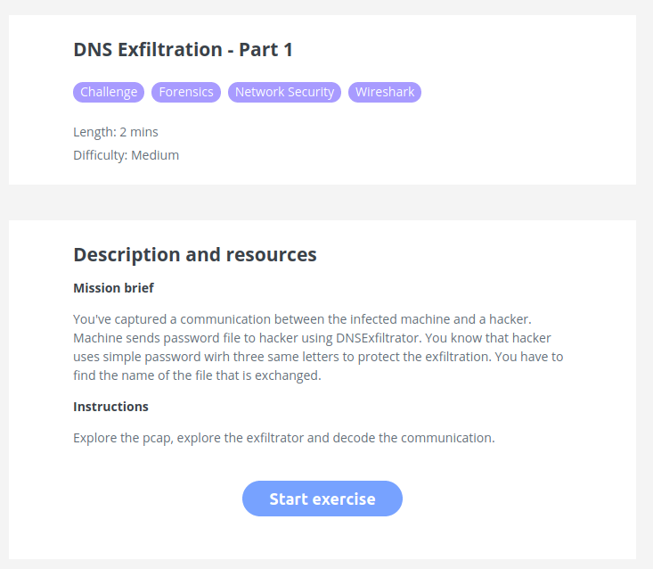
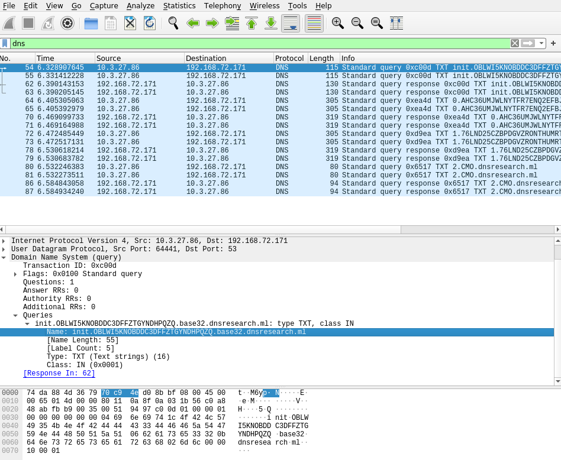
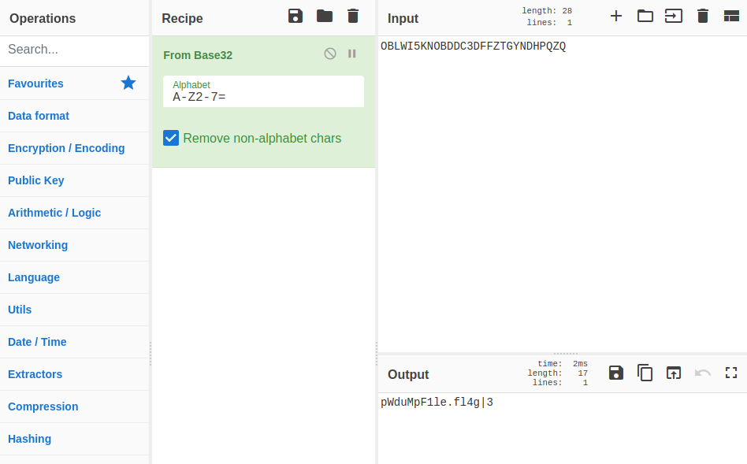
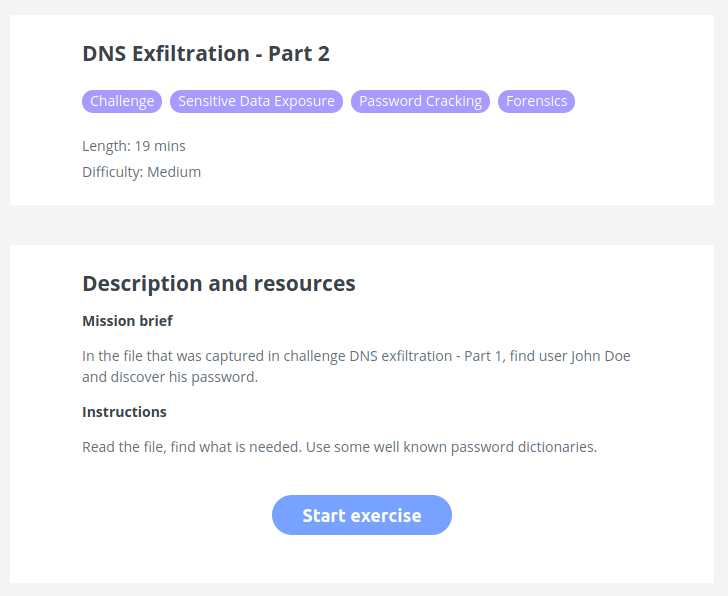
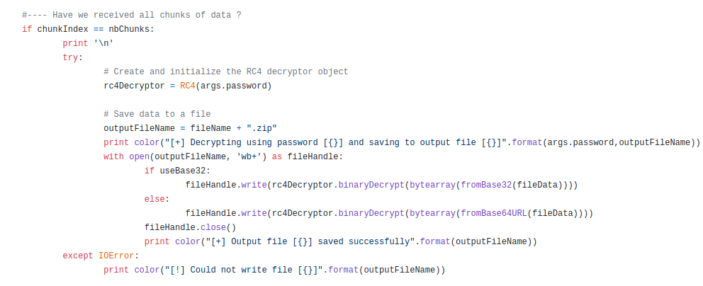
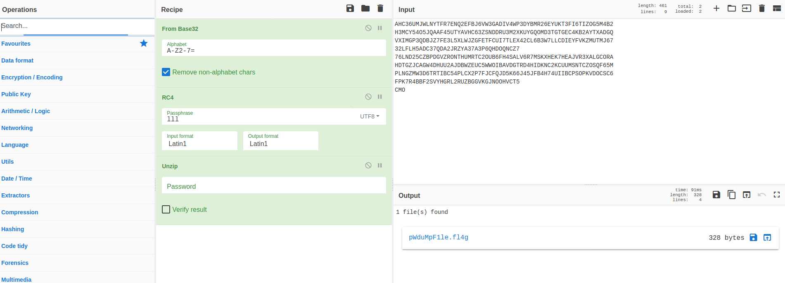
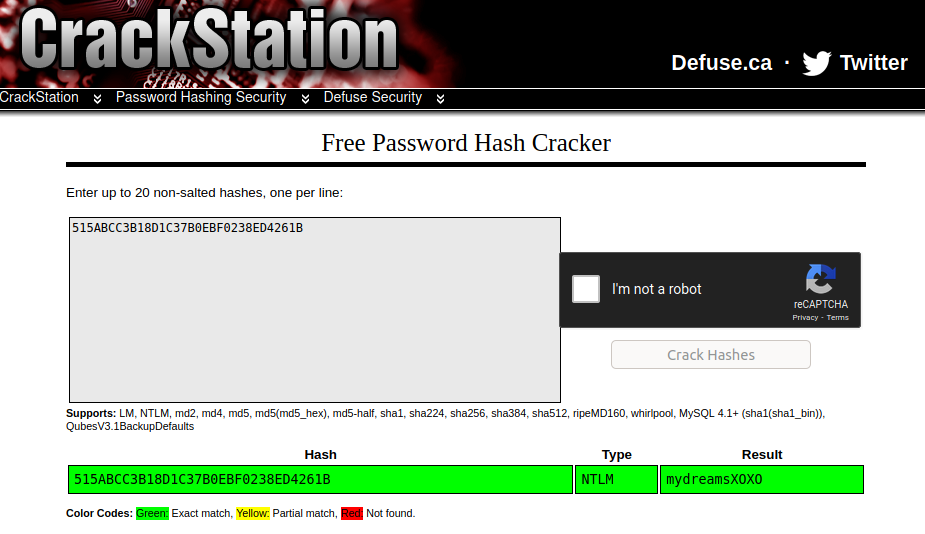

# DNSExfiltrator-SCC2021-Challenge-Writeup

Writeup for DNSExfiltrator challanges from Serbian Cybersecurity Challenge 2021

## Part 1



We got challengeDNS_anon.pcapng file, and if we open it with Wireshark and apply 'dns' filter we can see that first packet has name ```init.OBLWI5KNOBDDC3DFFZTGYNDHPQZQ.base32.dnsresearch.ml```



We can run next command to decode given string:
```sh
echo "OBLWI5KNOBDDC3DFFZTGYNDHPQZQ" | base32 -d
```
And we got the flag for the first part, name of the file that is exchanged is **pWduMpF1le.fl4g**

Alternatively, we can use CyberChef or any other online tool that can decode base32:



## Part 2



To solve the second part, we need to go back to description of part 1, and find out how DNS exfiltration works. On github is source code of [DNSExfiltrator tool]("https://github.com/Arno0x/DNSExfiltrator"):



Here we can see, that on receiving side the data is firstly decoded from base32, then decrypted with RC4, and at the end we write data into file with .zip extension.

So to solve the challange we need to extract base32 encoded data from packets. Apply filter: dns && ip.dst == 10.3.27.86, and go to File->Export Packet Dissections -> As Plain Text, from there we can extract base32 encoded strings, all join them into one:

```
AHC36UMJWLNYTFR7ENQ2EFBJ6VW3GADIV4WP3DYBMR26EYUKT3FI6TIZOG5M4B2
H3MCY54O5JQAAF45UTYAVHC63ZSNDDRU3M2XKUYGQOMD3TGTGEC4KB2AYTXADGQ
VXIMGP3QDBJZ7FE3L5XLWJZGFETFCUI7TLEX42CL6B3W7LLCDIEYFVKZMUTMJ67
32LFLH5ADC37QDA2JRZYA37A3P6QHDOQNCZ7
76LND25CZBPDGVZRONTHUMRTC2OUB6FH4SALV6R7MSKXHEK7HEAJVR3XALGCORA
HDTGZJCAGW4DHUU2AJDBWZEUC5WWOIBAVDGTRD4HIDKNC2KCUUMSNTCZOSQF65M
PLNGZMW3D6TRTIBC54PLCX2P7FJCFQJD5K66J45JFB4H74UIIBCPSOPKVDOCSC6
FPK7R4BBF2SVYHGRL2RUZBGGVKGJNOOHVCT5
CMO
```

Tshark is a terminal oriented version of Wireshark, so we can use it to extract data from file:
```sh
tshark -r challengeDNS_anon.pcapng -Tfields -e dns.qry.name ip.addr==10.3.27.86 | sed -n '0~4p'
``` 

From the first part description, we know that the hacker uses simple password with three same letters to protect the exfiltration. So when we setup our [cyberchef receip](https://gchq.github.io/CyberChef/#recipe=From_Base32('A-Z2-7%3D',true)RC4(%7B'option':'UTF8','string':'lll'%7D,'Latin1','Latin1')Unzip('',false)&input=QUhDMzZVTUpXTE5ZVEZSN0VOUTJFRkJKNlZXM0dBRElWNFdQM0RZQk1SMjZFWVVLVDNGSTZUSVpPRzVNNEIyCkgzTUNZNTRPNUpRQUFGNDVVVFlBVkhDNjNaU05ERFJVM00yWEtVWUdRT01EM1RHVEdFQzRLQjJBWVRYQURHUQpWWElNR1AzUURCSlo3RkUzTDVYTFdKWkdGRVRGQ1VJN1RMRVg0MkNMNkIzVzdMTENESUVZRlZLWk1VVE1KNjcKMzJMRkxINUFEQzM3UURBMkpSWllBMzdBM1A2UUhET1FOQ1o3Cjc2TE5EMjVDWkJQREdWWlJPTlRIVU1SVEMyT1VCNkZINFNBTFY2UjdNU0tYSEVLN0hFQUpWUjNYQUxHQ09SQQpIRFRHWkpDQUdXNERIVVUyQUpEQldaRVVDNVdXT0lCQVZER1RSRDRISURLTkMyS0NVVU1TTlRDWk9TUUY2NU0KUExOR1pNVzNENlRSVElCQzU0UExDWDJQN0ZKQ0ZRSkQ1SzY2SjQ1SkZCNEg3NFVJSUJDUFNPUEtWRE9DU0M2CkZQSzdSNEJCRjJTVllIR1JMMlJVWkJHR1ZLR0pOT09IVkNUNQpDTU8) we can manually change letters (aaa, bbb, ccc...) for RC4 password, until we come to **lll** which will give us a valid zip file. 




Inside the downloaded file we have this:
```
Administrator:500:NO PASSWORD*********************:31D4CFE1D1DAE531B73C59D7E0C089C0:::
Guest:501:NO PASSWORD*********************:NO PASSWORD*********************:::
admin:1000:NO PASSWORD*********************:0857632E42732DCC64201A80A05DD8D9:::
John Doe:1001:NO PASSWORD*********************:515ABCC3B18D1C37B0EBF0238ED4261B:::
```

On the crackstation.net we can supply our hash for John Doe password:



Our flag is: **mydreamsXOXO**


